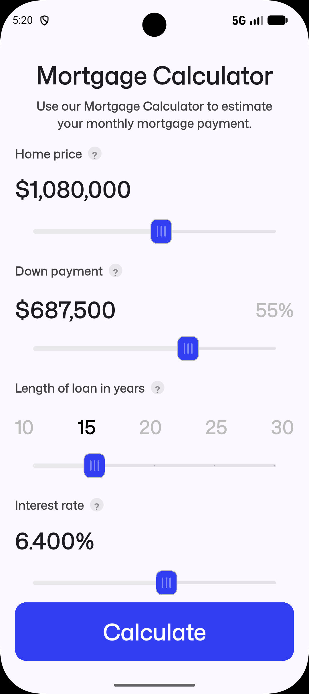
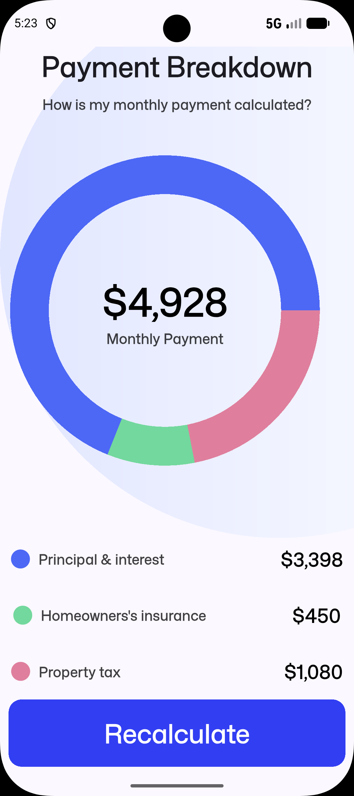

# Mortgage Calculator

A Flutter app that estimates your monthly mortgage payment from home price,
down payment, loan length, and interest rate — with a results breakdown and
chart.

## Features

- Sliders/inputs for home price, down payment, loan term (years), and
  interest rate
- Calculates:
  - Principal & interest (standard amortization formula)
  - Estimated monthly home insurance (0.5% of price / 12)
  - Estimated monthly property tax (1.2% of price / 12)
  - Total estimated monthly payment
- Results page with a visual breakdown chart (via `fl_chart`)
- Custom slider styling (`customs_widgets.dart`)

## Project structure

```
lib/
├── main.dart               # App entry point
├── input_page.dart         # Input screen: price, down payment, term, rate
├── calculate_mortgage.dart # Mortgage math (principal & interest, tax, insurance)
├── results_page.dart       # Results screen with payment breakdown chart
├── customs_widgets.dart    # Custom slider thumb shape / shared widgets
└── constants.dart          # Shared text styles and colors
```

## Screenshots

  
  

## Getting Started

This is a standard Flutter project.

1. Install [Flutter](https://docs.flutter.dev/get-started/install)
2. Clone this repo and run:
   ```
   flutter pub get
   flutter run
   ```

### Dependencies

- [`intl`](https://pub.dev/packages/intl) — number/currency formatting
- [`fl_chart`](https://pub.dev/packages/fl_chart) — results breakdown chart
